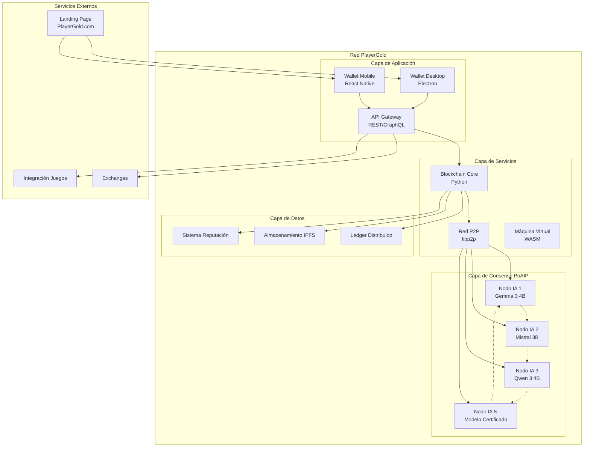

# Documento de Diseño - Arquitectura Distribuida de Nodos IA

## Visión General

Este documento describe el diseño técnico de la arquitectura distribuida de nodos IA para PlayerGold ($PRGLD), construida sobre la tecnología GamerChain. El sistema implementa un consenso PoAIP (Proof-of-AI-Participation) donde únicamente inteligencias artificiales pueden participar en la validación de bloques, eliminando el factor humano y sus potenciales sesgos o corrupciones.

### Principios Fundamentales

- **Equidad**: Recompensas equitativas independientes del poder económico
- **Descentralización**: Red distribuida sin puntos únicos de fallo
- **Transparencia**: Código abierto y operaciones auditables
- **Libertad**: Pagos sin censura ni restricciones ideológicas
- **Democracia**: Gobernanza descentralizada gestionada por IAs

## Arquitectura

### Diagrama de Arquitectura General



### Componentes Principales

#### 1. Nodos IA Validadores

**Propósito**: Ejecutar modelos IA locales para participar en el consenso PoAIP

**Tecnologías**:
- Modelos IA: Gemma 3 4B, Mistral 3B, Qwen 3 4B (certificados por hash)
- Runtime: Python con PyTorch/TensorFlow
- Hardware mínimo: 4GB VRAM, 4 cores CPU, 8GB RAM

**Funcionalidades**:
- Verificación de hash de modelo IA
- Procesamiento de challenges matemáticos
- Validación cruzada entre nodos
- Participación en consenso distribuido
- Gestión automática de reputación

#### 2. Blockchain Core

**Propósito**: Motor principal de la blockchain con consenso PoAIP

**Tecnologías**:
- Lenguaje: Python 3.9+
- Base de datos: LevelDB para persistencia local
- Criptografía: Ed25519 para firmas, SHA-256 para hashing

**Funcionalidades**:
- Gestión de bloques y transacciones
- Implementación del consenso PoAIP
- Distribución de recompensas (90% nodos IA, 10% stakers)
- Manejo de fees (20% liquidez, 80% quema)
- Sistema de reputación integrado

#### 3. Red P2P

**Propósito**: Comunicación descentralizada entre nodos

**Tecnologías**:
- Protocolo: libp2p personalizado
- Transporte: TCP/UDP con TLS
- Descubrimiento: mDNS + DHT Kademlia

**Funcionalidades**:
- Auto-descubrimiento de peers
- Propagación de transacciones y bloques
- Sincronización de estado
- Resistencia a particiones de red

#### 4. Wallet Desktop

**Propósito**: Interfaz de usuario para gestión de tokens y minería

**Tecnologías**:
- Framework: Electron + React
- Criptografía: Web3.js adaptado
- Almacenamiento: Encrypted local storage

**Funcionalidades**:
- Gestión de carteras múltiples
- Envío/recepción de tokens
- Modo minería con descarga de IA
- Monitoreo de reputación
- Quema voluntaria de tokens

## Componentes y Interfaces

### Interfaz de Nodo IA

```python
class AINode:
    def __init__(self, model_path: str, model_hash: str):
        self.model = self.load_and_verify_model(model_path, model_hash)
        self.reputation = ReputationManager()
        self.p2p = P2PNetwork()
        
    def load_and_verify_model(self, path: str, expected_hash: str) -> AIModel:
        """Carga y verifica el hash del modelo IA"""
        
    def process_challenge(self, challenge: Challenge) -> Solution:
        """Procesa challenge matemático usando IA"""
        
    def validate_block(self, block: Block) -> ValidationResult:
        """Valida un bloque usando capacidades de IA"""
        
    def cross_validate(self, solution: Solution) -> bool:
        """Realiza validación cruzada de soluciones de otros nodos"""
```

### Interfaz de Consenso PoAIP

```python
class PoAIPConsensus:
    def __init__(self, ai_nodes: List[AINode]):
        self.nodes = ai_nodes
        self.challenge_generator = ChallengeGenerator()
        
    def propose_block(self, transactions: List[Transaction]) -> Block:
        """Propone un nuevo bloque para validación"""
        
    def generate_challenge(self, block: Block) -> Challenge:
        """Genera challenge matemático específico para IAs"""
        
    def collect_solutions(self, challenge: Challenge) -> List[Solution]:
        """Recolecta soluciones de nodos IA en <100ms"""
        
    def validate_consensus(self, solutions: List[Solution]) -> bool:
        """Valida consenso basado en soluciones de IA"""
        
    def distribute_rewards(self, validators: List[AINode]):
        """Distribuye recompensas equitativamente"""
```

### Interfaz de Sistema de Reputación

```python
class ReputationSystem:
    def __init__(self):
        self.node_reputation = {}
        self.user_reputation = {}
        
    def update_node_reputation(self, node_id: str, event: ReputationEvent):
        """Actualiza reputación de nodo basado en comportamiento"""
        
    def update_user_reputation(self, user_id: str, burned_tokens: int):
        """Actualiza reputación de usuario por quema voluntaria"""
        
    def get_transaction_priority(self, user_id: str) -> int:
        """Calcula prioridad de transacción basada en reputación"""
        
    def apply_penalty(self, node_id: str, severity: PenaltySeverity):
        """Aplica penalización por anomalías detectadas"""
```

## Modelos de Datos

### Estructura de Bloque

```python
@dataclass
class Block:
    index: int
    previous_hash: str
    timestamp: float
    transactions: List[Transaction]
    merkle_root: str
    ai_validators: List[str]  # IDs de nodos IA que validaron
    consensus_proof: ConsensusProof
    hash: str
    
@dataclass
class ConsensusProof:
    challenge: Challenge
    solutions: List[Solution]
    cross_validations: List[CrossValidation]
```

### Estructura de Transacción

```python
@dataclass
class Transaction:
    from_address: str
    to_address: str
    amount: Decimal
    fee: Decimal
    timestamp: float
    signature: str
    nonce: int
    transaction_type: TransactionType  # TRANSFER, BURN, STAKE
    
@dataclass
class FeeDistribution:
    liquidity_pool: Decimal  # 20%
    burn_address: Decimal    # 80%
```

### Estructura de Nodo IA

```python
@dataclass
class AINodeInfo:
    node_id: str
    model_name: str
    model_hash: str
    hardware_specs: HardwareSpecs
    reputation_score: float
    last_validation: datetime
    total_validations: int
    penalties: List[Penalty]
    
@dataclass
class HardwareSpecs:
    gpu_memory: int  # GB
    cpu_cores: int
    ram: int  # GB
    verified: bool
```

## Manejo de Errores

### Estrategias de Recuperación

1. **Fallo de Nodo IA**:
   - Detección automática de nodos no responsivos
   - Redistribución de carga entre nodos activos
   - Reinicio automático con verificación de modelo

2. **Partición de Red**:
   - Consenso en partición mayoritaria
   - Sincronización automática al reconectar
   - Resolución de conflictos por timestamp y reputación

3. **Modelo IA Corrupto**:
   - Verificación de hash en cada inicio
   - Exclusión inmediata de nodos con hash inválido
   - Notificación al usuario para re-descarga

4. **Ataques de Consenso**:
   - Detección de patrones anómalos por IA
   - Penalización automática de comportamiento malicioso
   - Aislamiento temporal de nodos sospechosos

### Códigos de Error

```python
class ErrorCodes:
    # Errores de Nodo IA
    AI_MODEL_HASH_MISMATCH = 1001
    AI_MODEL_LOAD_FAILED = 1002
    AI_CHALLENGE_TIMEOUT = 1003
    AI_INVALID_SOLUTION = 1004
    
    # Errores de Consenso
    CONSENSUS_INSUFFICIENT_NODES = 2001
    CONSENSUS_VALIDATION_FAILED = 2002
    CONSENSUS_TIMEOUT = 2003
    
    # Errores de Red
    NETWORK_PARTITION = 3001
    PEER_CONNECTION_FAILED = 3002
    SYNC_FAILED = 3003
    
    # Errores de Transacción
    INSUFFICIENT_BALANCE = 4001
    INVALID_SIGNATURE = 4002
    NONCE_MISMATCH = 4003
```

## Estrategia de Testing

### Testing de Nodos IA

1. **Unit Tests**:
   - Verificación de hash de modelos
   - Procesamiento de challenges
   - Validación cruzada

2. **Integration Tests**:
   - Comunicación P2P entre nodos
   - Consenso con múltiples IAs
   - Distribución de recompensas

3. **Performance Tests**:
   - Tiempo de respuesta <100ms
   - Throughput de transacciones
   - Escalabilidad de red

### Testing de Consenso PoAIP

1. **Simulación de Red**:
   - 100+ nodos virtuales
   - Diferentes modelos IA
   - Condiciones de red adversas

2. **Testing de Seguridad**:
   - Ataques de consenso
   - Nodos maliciosos
   - Particiones de red

3. **Testing de Reputación**:
   - Penalizaciones por anomalías
   - Recompensas por buen comportamiento
   - Priorización de transacciones

### Métricas de Calidad

- **Disponibilidad**: >99.9% uptime
- **Latencia**: <2 segundos por transacción
- **Throughput**: >100 TPS
- **Consenso**: <100ms por challenge
- **Seguridad**: 0 compromisos de consenso

## Consideraciones de Seguridad

### Verificación de Modelos IA

1. **Hash Verification**:
   - SHA-256 de archivos de modelo
   - Lista blanca de hashes certificados
   - Verificación en cada inicio de nodo

2. **Sandboxing**:
   - Ejecución de IA en entorno aislado
   - Límites de recursos (CPU, memoria)
   - Monitoreo de comportamiento anómalo

### Protección de Consenso

1. **Challenge Design**:
   - Problemas matemáticos específicos para IA
   - Imposibles de resolver por humanos en <100ms
   - Rotación de tipos de challenge

2. **Cross-Validation**:
   - Mínimo 3 nodos validadores por solución
   - Detección de colusión entre nodos
   - Penalización por validaciones incorrectas

### Seguridad de Red

1. **Encriptación**:
   - TLS 1.3 para comunicaciones P2P
   - Ed25519 para firmas de transacciones
   - AES-256 para almacenamiento local

2. **Rate Limiting**:
   - Límites por IP y por nodo
   - Protección contra DDoS
   - Throttling adaptativo

## Optimización de Rendimiento

### Optimización de IA

1. **Model Optimization**:
   - Quantización de modelos para reducir VRAM
   - Optimización específica por hardware
   - Caching de inferencias frecuentes

2. **Parallel Processing**:
   - Procesamiento paralelo de challenges
   - Pipeline de validación
   - Batch processing de transacciones

### Optimización de Red

1. **Connection Pooling**:
   - Reutilización de conexiones P2P
   - Multiplexing de mensajes
   - Compresión de datos

2. **Caching Strategy**:
   - Cache de bloques recientes
   - Cache de validaciones
   - Cache de reputación

### Optimización de Almacenamiento

1. **Data Compression**:
   - Compresión de bloques históricos
   - Pruning de datos antiguos
   - Sharding de datos por nodo

2. **Database Optimization**:
   - Índices optimizados para consultas frecuentes
   - Particionado de tablas grandes
   - Backup incremental

Este diseño proporciona una base sólida para implementar la arquitectura distribuida de nodos IA de PlayerGold, manteniendo los principios de equidad, descentralización y eliminación del factor humano en el consenso.