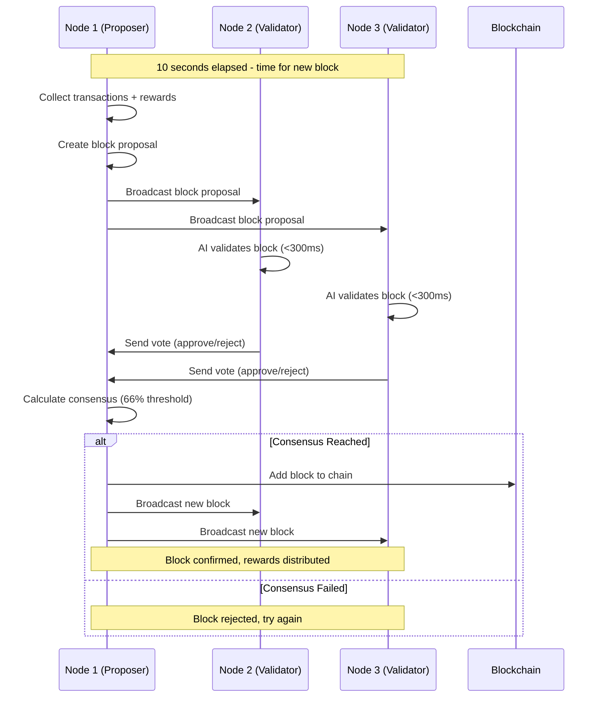

# PlayerGold Multi-Node Network

## Overview

This implementation provides a complete multi-node blockchain network for PlayerGold ($PRGLD) with distributed AI consensus (PoAIP - Proof-of-AI-Participation).

## Key Features

### 🤖 AI-Powered Consensus
- **66% consensus threshold** for block validation
- Only AI nodes can participate in consensus
- Reputation-based validator selection (>90% for reward distribution)
- Cross-validation between AI nodes

### ⏰ Guaranteed Block Production
- **10-second block intervals** guaranteed
- Automatic reward transactions in every block
- Never-empty blocks ensure continuous mining

### 💰 Economic Model
- **Initial reward**: 1,024 PRGLD per block
- **Halving**: Every 100,000 blocks
- **Liquidity pool**: 1,024M PRGLD initial supply
- **Fee distribution**: 30% developer, 10% liquidity pool, 60% burn

### 🏗️ Bootstrap Process
- Exactly **2 pioneer nodes** required for genesis
- Automatic genesis block creation when pioneers connect
- System addresses auto-generated (pool, burn, developer)
- Developer recovery data sent via email

### 🔒 Network Security
- **Public IPs only** - rejects private/local IPs automatically
- TLS 1.3 encryption for all P2P communication
- Network compatibility validation
- Genesis pioneers can reset testnet (mainnet immutable)

## Architecture

```
┌─────────────────────────────────────────────────────────────┐
│                    PlayerGold Network                       │
├─────────────────────────────────────────────────────────────┤
│  Multi-Node Consensus (PoAIP)                              │
│  ├── Bootstrap Manager (Genesis Creation)                   │
│  ├── Consensus Engine (66% threshold)                      │
│  ├── Halving Manager (100K block intervals)                │
│  └── Reward Distribution (Random selection >90% rep)       │
├─────────────────────────────────────────────────────────────┤
│  P2P Network Layer                                         │
│  ├── Public IP Validation                                  │
│  ├── TLS 1.3 Encryption                                    │
│  ├── Network Compatibility Check                           │
│  └── Auto-discovery & Bootstrap Nodes                      │
├─────────────────────────────────────────────────────────────┤
│  Enhanced Blockchain                                       │
│  ├── Multi-transaction Types                               │
│  ├── Fee Distribution (30/10/60)                          │
│  ├── System Address Management                             │
│  └── Balance & History Tracking                            │
├─────────────────────────────────────────────────────────────┤
│  Crypto & Wallet                                          │
│  ├── Ed25519 Key Generation                               │
│  ├── PlayerGold Address Format (PG prefix)                │
│  ├── Mnemonic Phrase Support                              │
│  └── Digital Signatures                                    │
└─────────────────────────────────────────────────────────────┘
```

## Quick Start

### 1. Install Dependencies

```bash
pip install -r requirements_multinode.txt
```

### 2. Launch Testnet (Easy Mode)

```bash
# Launch 2 pioneer nodes for genesis creation
python scripts/launch_testnet.py

# Or launch more nodes
python scripts/launch_testnet.py --nodes 4
```

### 3. Launch Individual Nodes

```bash
# Pioneer Node 1
python scripts/start_multinode_network.py --node-id pioneer_1 --port 18080

# Pioneer Node 2 (in another terminal)
python scripts/start_multinode_network.py --node-id pioneer_2 --port 18081
```

### 4. Monitor Network

```bash
# Check node health
curl http://127.0.0.1:19080/api/v1/health

# Check network status
curl http://127.0.0.1:19080/api/v1/network/status

# Check blockchain stats
curl http://127.0.0.1:19080/api/v1/blockchain/stats
```

## API Endpoints

### Health & Status
- `GET /api/v1/health` - Node health check
- `GET /api/v1/network/status` - Complete network status
- `GET /api/v1/blockchain/stats` - Blockchain statistics

### Wallet Operations
- `GET /api/v1/balance/<address>` - Get address balance
- `GET /api/v1/transactions/history/<address>` - Transaction history

### Testnet Operations
- `POST /api/v1/faucet` - Request testnet tokens
- `POST /api/v1/bootstrap/reset` - Reset blockchain (genesis pioneers only)

## Genesis Block Creation Process

1. **Pioneer Connection**: Exactly 2 AI nodes must connect to the network
2. **System Setup**: Automatic generation of:
   - Liquidity pool address (1,024M PRGLD)
   - Burn address (for token burning)
   - Developer address (30% of fees)
3. **Genesis Block**: Created with system initialization transactions
4. **Email Notification**: Developer recovery data sent automatically
5. **Network Activation**: 10-second block production begins

## Multi-Node Consensus Flow



## Network Configuration

### Testnet
- **Network ID**: `playergold-testnet-v1`
- **P2P Port**: 18080
- **API Port**: 19080
- **Faucet**: Enabled (1,000 PRGLD per request)
- **Reset**: Allowed (genesis pioneers only)

### Mainnet
- **Network ID**: `playergold-mainnet-v1`
- **P2P Port**: 18081
- **API Port**: 19081
- **Faucet**: Disabled
- **Reset**: Never allowed (immutable)

## File Structure

```
src/
├── blockchain/
│   ├── enhanced_blockchain.py    # Multi-node blockchain
│   └── ...
├── consensus/
│   ├── bootstrap_manager.py      # Genesis creation
│   └── multinode_consensus.py    # PoAIP consensus
├── crypto/
│   └── wallet.py                 # Key generation & addresses
├── network/
│   └── network_manager.py        # Network configurations
└── p2p/
    └── network.py                # P2P networking

scripts/
├── start_multinode_network.py    # Single node launcher
└── launch_testnet.py             # Multi-node launcher
```

## Development & Testing

### Running Tests
```bash
# Run all tests
pytest tests/

# Run specific test categories
pytest tests/test_consensus.py
pytest tests/test_blockchain.py
pytest tests/test_p2p.py
```

### Development Mode
```bash
# Launch with debug logging
python scripts/start_multinode_network.py --node-id dev_node --log-level DEBUG
```

### Reset Testnet
```bash
# Reset blockchain (genesis pioneers only)
curl -X POST http://127.0.0.1:19080/api/v1/bootstrap/reset \
  -H "Content-Type: application/json" \
  -d '{"node_id": "pioneer_1"}'
```

## Security Features

### Public IP Validation
- Automatically rejects private IP ranges (10.x.x.x, 192.168.x.x, etc.)
- Blocks loopback and link-local addresses
- Ensures true distributed network

### Genesis Privileges
- Only the original 2 pioneer nodes can reset testnet
- Mainnet is immutable once created
- Privilege verification for all administrative operations

### Fee Distribution Security
- Automatic 30/10/60 split prevents manipulation
- Developer address generated securely during genesis
- Recovery data sent via email for backup

## Troubleshooting

### Genesis Block Not Created
- Ensure exactly 2 nodes are running
- Check that nodes can connect to each other
- Verify public IP accessibility
- Monitor logs for connection errors

### Consensus Issues
- Check node reputation scores (need >90% for rewards)
- Verify AI validation timing (<300ms)
- Ensure 66% of nodes are responding

### Network Connectivity
- Confirm public IP addresses
- Check firewall settings
- Verify P2P port accessibility
- Test with `telnet <ip> <port>`

## Monitoring & Metrics

### Key Metrics to Monitor
- **Peer Count**: Number of connected nodes
- **Block Height**: Current blockchain height
- **Consensus Rate**: Percentage of successful consensus
- **Reward Distribution**: Mining rewards per validator
- **Network Hash Rate**: Overall network performance

### Log Analysis
```bash
# Filter consensus logs
grep "consensus" node.log

# Monitor block production
grep "Block #" node.log

# Check P2P connections
grep "Connected to peer" node.log
```

## Production Deployment

### Hardware Requirements
- **CPU**: 4+ cores
- **RAM**: 8GB minimum
- **Storage**: 100GB SSD
- **Network**: Public IP with stable connection
- **GPU**: 4GB VRAM for AI model (future)

### Network Setup
1. Configure firewall for P2P port
2. Ensure public IP accessibility
3. Set up monitoring and alerting
4. Configure automatic restarts
5. Set up log rotation

### Mainnet Launch Checklist
- [ ] Genesis pioneers identified
- [ ] Network configuration finalized
- [ ] Bootstrap nodes deployed
- [ ] Monitoring systems active
- [ ] Emergency procedures documented
- [ ] Community notification prepared

## Contributing

1. Fork the repository
2. Create feature branch
3. Implement changes with tests
4. Submit pull request
5. Ensure all tests pass

## License

This project is licensed under the MIT License - see the LICENSE file for details.

---

**PlayerGold Multi-Node Network** - Decentralized AI-powered blockchain for gaming