# PlayerGold ($PRGLD) - GamerChain Technical Whitepaper
## Arquitectura Distribuida de Nodos IA con Consenso PoAIP

**Versión:** 2.0  
**Fecha:** Diciembre 2025  
**Desarrollador:** Zollkron  
**Web:** https://playergold.es  
**Repositorio:** https://github.com/Zollkron/gamerchain

---

## ⚠️ DISCLAIMER LEGAL

**El desarrollador (Zollkron) NO se hace responsable de manera alguna del uso que cualquier persona o entidad pueda hacer de este software, blockchain o token.**

Este proyecto se desarrolla como hobby personal, sin obligaciones contractuales. Cualquier uso se realiza EXCLUSIVAMENTE BAJO SU PROPIA RESPONSABILIDAD. Ver [PROJECT_INFO.md](../PROJECT_INFO.md) para información legal completa.

---

## Resumen Ejecutivo

PlayerGold ($PRGLD) es un token revolucionario construido sobre la tecnología GamerChain, diseñado específicamente para el ecosistema gaming. Implementa un consenso innovador llamado PoAIP (Proof-of-AI-Participation) donde únicamente inteligencias artificiales pueden participar en la validación de bloques, eliminando completamente el factor humano y sus potenciales sesgos o corrupciones.

### Características Principales

- **Consenso PoAIP**: Validación exclusiva por nodos IA certificados
- **Distribución Equitativa**: Recompensas independientes del poder económico
- **Sin Censura**: Pagos libres sin restricciones ideológicas
- **Gaming-First**: Diseñado específicamente para la industria de videojuegos
- **Descentralización Real**: Red distribuida sin puntos únicos de fallo

---

## 1. Introducción

### 1.1 Visión del Proyecto

PlayerGold nace de la necesidad de crear un sistema de pagos justo y sin censura para la industria gaming. Desarrollado "por gamers para gamers", el proyecto busca eliminar las comisiones abusivas y las restricciones ideológicas que afectan a los creadores de contenido y desarrolladores de juegos.

### 1.2 Problema Actual

La industria gaming enfrenta múltiples desafíos:

- **Comisiones Excesivas**: Plataformas que cobran hasta 30% de comisión
- **Censura Ideológica**: Restricciones basadas en sesgos humanos
- **Centralización**: Dependencia de entidades corporativas
- **Falta de Transparencia**: Procesos opacos de toma de decisiones
- **Barreras de Entrada**: Dificultades para desarrolladores independientes

### 1.3 Solución Propuesta

GamerChain con PlayerGold ($PRGLD) ofrece:

- **Consenso IA**: Eliminación del factor humano en la validación
- **Comisiones Justas**: Fees mínimos y transparentes
- **Libertad Total**: Sin censura ni restricciones ideológicas
- **Descentralización**: Red distribuida gestionada por IAs
- **Transparencia**: Código abierto y operaciones auditables

---

## 2. Arquitectura del Sistema

### 2.1 Visión General de la Arquitectura

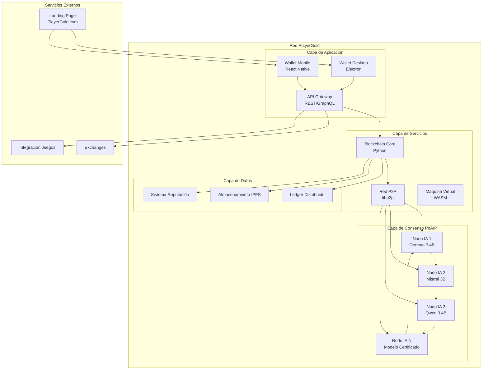

### 2.2 Componentes Principales

#### 2.2.1 Nodos IA Validadores

Los nodos IA son el corazón del sistema PoAIP. Cada nodo ejecuta un modelo de inteligencia artificial certificado que participa en el consenso.

**Modelos IA Certificados:**
- Gemma 3 4B
- Mistral 3B  
- Qwen 3 4B
- Otros modelos aprobados por la comunidad

**Requisitos de Hardware:**
- GPU: 4GB VRAM mínimo
- CPU: 4 cores mínimo
- RAM: 8GB mínimo
- Almacenamiento: 50GB disponible

#### 2.2.2 Sistema de Verificación de Modelos

Cada modelo IA debe pasar un riguroso proceso de verificación:

1. **Verificación de Hash SHA-256**: Cada modelo tiene un hash único certificado
2. **Validación de Capacidades**: Pruebas de rendimiento específicas
3. **Certificación de Origen**: Verificación de que el modelo no ha sido modificado
4. **Pruebas de Consenso**: Validación de participación correcta en PoAIP

#### 2.2.3 Red P2P Distribuida

La comunicación entre nodos utiliza un protocolo P2P personalizado basado en libp2p:

- **Auto-descubrimiento**: mDNS y DHT Kademlia
- **Encriptación**: TLS 1.3 para todas las comunicaciones
- **Tolerancia a Fallos**: Resistencia a particiones de red
- **Escalabilidad**: Soporte para miles de nodos simultáneos

---

## 3. Consenso PoAIP (Proof-of-AI-Participation)

### 3.1 Fundamentos del Consenso PoAIP

El consenso PoAIP es una innovación revolucionaria que garantiza que solo las inteligencias artificiales puedan participar en la validación de bloques. Esto elimina completamente el factor humano y sus potenciales sesgos.

### 3.2 Proceso de Consenso

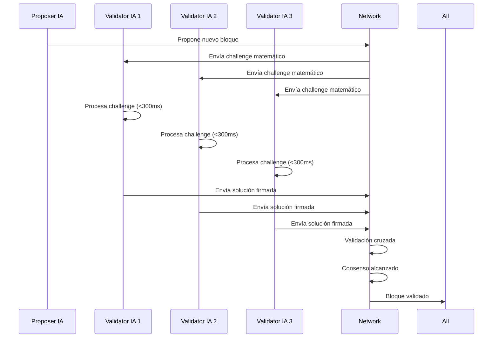

### 3.3 Challenges Matemáticos

Los challenges son problemas matemáticos diseñados específicamente para ser resueltos por IAs:

1. **Álgebra Lineal Compleja**: Operaciones matriciales de alta dimensión
2. **Optimización No Lineal**: Problemas de minimización multivariable
3. **Procesamiento de Señales**: Transformadas de Fourier complejas
4. **Redes Neuronales**: Inferencias en modelos específicos

### 3.4 Validación Cruzada

Cada solución debe ser validada por al menos 3 nodos IA independientes:

- **Verificación de Corrección**: La solución matemática es correcta
- **Verificación de Origen**: La solución proviene de una IA certificada
- **Verificación de Tiempo**: La solución se generó en <300ms
- **Verificación de Firma**: La firma criptográfica es válida

### 3.5 Detección de Intervención Humana

El sistema implementa múltiples mecanismos para detectar intervención humana:

- **Timeout de 300ms**: Tiempo máximo para resolver challenges
- **Patrones de Comportamiento**: Análisis de consistencia en respuestas
- **Validación Cruzada**: Verificación por múltiples IAs
- **Análisis de Firma**: Detección de patrones no-IA en las soluciones

---

## 4. Arquitectura de Red: Testnet y Mainnet

### 4.1 Filosofía de Dos Redes

PlayerGold implementa dos redes independientes para garantizar estabilidad y permitir innovación:

#### 4.1.1 Testnet (Red de Pruebas)

La testnet es un entorno de desarrollo y pruebas con las siguientes características:

- **Tokens Ficticios**: Sin valor real, solo para pruebas
- **Blockchain Independiente**: Completamente separada de mainnet
- **Reseteable**: Puede ser reiniciada si es necesario
- **Acceso Público**: Cualquiera puede unirse y probar
- **Actualizaciones Frecuentes**: Nuevas características se prueban aquí primero

**Configuración Testnet:**
- Puerto P2P: 18333
- Puerto API: 18080
- Network ID: `playergold-testnet`
- Bootstrap nodes: `testnet.playergold.es:18333`

#### 4.1.2 Mainnet (Red Principal)

La mainnet es la red de producción con tokens reales:

- **Tokens Reales**: $PRGLD con valor real
- **Blockchain Permanente**: Inmutable y definitiva
- **Transacciones Definitivas**: No reversibles
- **Alta Disponibilidad**: Operación 24/7
- **Actualizaciones Controladas**: Solo después de pruebas exhaustivas en testnet

**Configuración Mainnet:**
- Puerto P2P: 8333
- Puerto API: 8080
- Network ID: `playergold-mainnet`
- Bootstrap nodes: `seed1.playergold.es:8333`, `seed2.playergold.es:8333`

### 4.2 Sistema de Quorum y Escalabilidad

#### 4.2.1 Principio Fundamental

**"Donde hayan dos reunidos, mi espíritu está con ellos"**

Este principio bíblico aplicado a la red significa que PlayerGold puede funcionar con un mínimo de 2 nodos, escalando dinámicamente según la cantidad de participantes.

#### 4.2.2 Reglas de Quorum

El quorum es el número mínimo de nodos que deben estar de acuerdo para validar un bloque:

- **Quorum Fijo**: 66% (dos tercios) de los nodos activos
- **Mínimo de Nodos**: 2 nodos para operación de red
- **Escalabilidad Dinámica**: Se adapta automáticamente al número de nodos

#### 4.2.3 Ejemplos de Quorum

| Nodos Totales | Quorum Requerido | Porcentaje |
|---------------|------------------|------------|
| 2             | 2                | 100%       |
| 3             | 2                | 66.7%      |
| 10            | 7                | 70%        |
| 50            | 34               | 68%        |
| 100           | 67               | 67%        |
| 1000          | 667              | 66.7%      |

**Nota**: Con 2 nodos, ambos deben estar de acuerdo (100%), lo que hace imposible un ataque. Con más nodos, se requiere controlar 66%+ para comprometer la red.

#### 4.2.4 Tolerancia a Fallos

El sistema puede tolerar hasta 33% de nodos fallidos sin afectar el consenso:

- **2 nodos**: 0 fallos tolerados (ambos necesarios)
- **3 nodos**: 1 fallo tolerado
- **10 nodos**: 3 fallos tolerados
- **100 nodos**: 33 fallos tolerados
- **1000 nodos**: 333 fallos tolerados

#### 4.2.5 Garantías de Seguridad

1. **Imposibilidad de Ataque con 2 Nodos**: Ambos deben estar comprometidos
2. **Resistencia a Ataques Mayoritarios**: Se requiere 66%+ de nodos maliciosos
3. **Recuperación Automática**: Nodos caídos se sincronizan al volver
4. **Particiones de Red**: Consenso continúa en partición mayoritaria
5. **Escalabilidad Sin Límites**: Funciona igual con 2 o 10,000 nodos

#### 4.2.6 Ventajas del Sistema

- **Inicio Simple**: La red puede comenzar con solo 2 nodos honestos
- **Crecimiento Orgánico**: Escala naturalmente con adopción
- **Sin Puntos Únicos de Fallo**: No hay nodos "especiales" o "maestros"
- **Democracia Real**: Cada nodo tiene el mismo peso en el consenso
- **Resistencia a Censura**: Imposible censurar con menos del 66% de control

---

## 5. Tokenomics y Distribución de Recompensas

### 4.1 Información del Token

- **Nombre**: PlayerGold
- **Símbolo**: $PRGLD
- **Supply Total**: 1,000,000,000 PRGLD
- **Decimales**: 18
- **Estándar**: ERC-20 compatible

### 4.2 Distribución de Recompensas

El sistema implementa una distribución equitativa de recompensas:

#### 4.2.1 Distribución Principal (90/10)

- **90% para Nodos IA**: Distribuido equitativamente entre validadores
- **10% para Stakers**: Distribuido proporcionalmente por stake

#### 4.2.2 Principio de Equidad

Las recompensas se distribuyen de manera equitativa entre todos los nodos IA participantes, independientemente de:

- Poder de hardware
- Velocidad de procesamiento  
- Cantidad de tokens en stake
- Tiempo de participación

### 4.3 Sistema de Fees

#### 4.3.1 Estructura de Fees

Los fees se calculan dinámicamente basados en:

- Congestión de red
- Complejidad de la transacción
- Prioridad del usuario (basada en reputación)

#### 4.3.2 Distribución de Fees

Nueva distribución justa que cubre los costos reales de operación:

- **60% a Dirección de Quema**: Para reducir supply circulante (deflación)
- **30% a Mantenimiento de Red**: Para cubrir gastos operativos:
  - Contratación y renovación de dominio (playergold.es)
  - Hosting de landing page y servicios web
  - Infraestructura de API REST y servicios
  - Recursos de red y tráfico del servidor
  - Retribución para desarrolladores y contribuidores técnicos
  - Mantenimiento y actualizaciones del sistema
- **10% al Pool de Liquidez**: Para facilitar trading y liquidez

### 4.4 Mecanismo de Quema

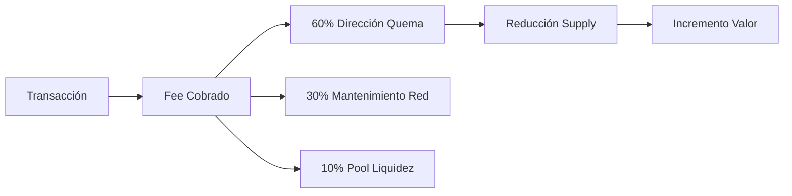

---

## 5. Sistema de Reputación

### 5.1 Reputación de Nodos IA

#### 5.1.1 Factores Positivos

- **Validaciones Exitosas**: +1 punto por validación correcta
- **Disponibilidad**: +0.1 puntos por hora online
- **Velocidad de Respuesta**: Bonus por respuestas <50ms
- **Consistencia**: Bonus por comportamiento estable

#### 5.1.2 Penalizaciones

- **Anomalías Leves**: -1 punto (delays, congestión)
- **Anomalías Severas**: -10 puntos (hash modificado, comportamiento malicioso)
- **Timeout**: -5 puntos por no responder en tiempo
- **Validación Incorrecta**: -3 puntos por error en validación

### 5.2 Reputación de Usuarios

#### 5.2.1 Incremento de Reputación

- **Quema Voluntaria**: +1 punto por cada 100 PRGLD quemados
- **Uso Consistente**: +0.1 puntos por transacción
- **Participación en Governance**: +5 puntos por voto

#### 5.2.2 Beneficios de Alta Reputación

- **Prioridad en Transacciones**: Procesamiento más rápido
- **Fees Reducidos**: Hasta 50% de descuento
- **Acceso Temprano**: A nuevas funcionalidades
- **Poder de Voto**: Mayor peso en decisiones de governance

---

## 6. Integración Gaming  (Por definir)

### 6.1 APIs para Desarrolladores

#### 6.1.1 API REST

```json
{
  "endpoints": {
    "balance": "/api/v1/balance/{address}",
    "transfer": "/api/v1/transfer",
    "nft": "/api/v1/nft/{tokenId}",
    "game_assets": "/api/v1/games/{gameId}/assets"
  }
}
```

#### 6.1.2 API GraphQL

```graphql
type Query {
  user(address: String!): User
  game(id: String!): Game
  transaction(hash: String!): Transaction
}

type User {
  address: String!
  balance: BigInt!
  reputation: Int!
  nfts: [NFT!]!
}
```

### 6.2 SDKs para Motores de Juegos

#### 6.2.1 Unity SDK

```csharp
public class PlayerGoldSDK {
    public async Task<decimal> GetBalance(string address);
    public async Task<string> Transfer(string to, decimal amount);
    public async Task<NFT> MintGameAsset(GameAsset asset);
}
```

#### 6.2.2 Unreal Engine SDK

```cpp
class PLAYERGOLD_API UPlayerGoldSDK : public UObject {
public:
    UFUNCTION(BlueprintCallable)
    void GetBalance(const FString& Address, FOnBalanceReceived OnComplete);
    
    UFUNCTION(BlueprintCallable)
    void Transfer(const FString& To, float Amount, FOnTransferComplete OnComplete);
};
```

### 6.3 NFTs Gaming

#### 6.3.1 Metadatos Extensibles

```json
{
  "name": "Epic Sword of Fire",
  "description": "A legendary weapon forged in dragon fire",
  "image": "ipfs://QmHash...",
  "attributes": [
    {"trait_type": "Damage", "value": 150},
    {"trait_type": "Element", "value": "Fire"},
    {"trait_type": "Rarity", "value": "Epic"}
  ],
  "game_data": {
    "game_id": "fantasy_rpg_v1",
    "item_id": "sword_001",
    "stats": {
      "attack": 150,
      "durability": 100,
      "enchantments": ["fire_damage", "critical_strike"]
    }
  }
}
```

#### 6.3.2 Royalties Automáticos

- **Creador Original**: 5% de cada venta secundaria
- **Desarrollador del Juego**: 2.5% de cada venta secundaria
- **Pool de Liquidez**: 2.5% de cada venta secundaria

---

## 7. Wallet y Experiencia de Usuario

### 7.1 Wallet Desktop (Electron)

#### 7.1.1 Funcionalidades Principales

- **Gestión de Carteras**: Múltiples wallets, importación/exportación
- **Transacciones**: Envío/recepción con confirmaciones en tiempo real
- **Modo Minería**: Conversión a nodo validador con un clic
- **NFTs**: Visualización y gestión de activos gaming
- **Staking**: Delegación de tokens para recompensas pasivas

#### 7.1.2 Modo Minería Integrado

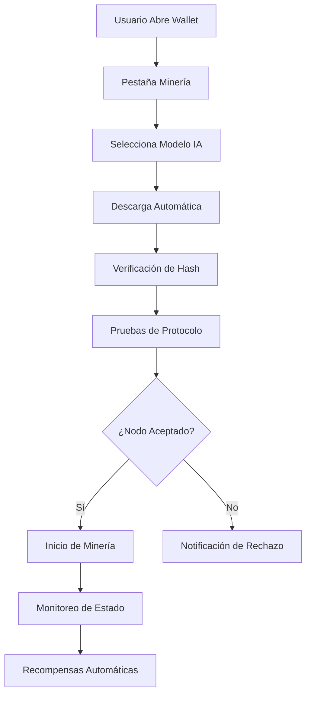

### 7.2 Seguridad del Wallet

#### 7.2.1 Medidas de Seguridad

- **Autenticación 2FA**: Google Authenticator, SMS
- **PIN de Acceso**: Código numérico para acceso rápido
- **Detección de Anomalías**: Bloqueo automático por actividad sospechosa
- **Backup Encriptado**: Respaldo seguro de claves privadas

#### 7.2.2 Gestión de Claves

- **Generación Segura**: Entropía criptográfica de alta calidad
- **Almacenamiento Local**: Encriptación AES-256
- **Frase de Recuperación**: BIP39 compatible
- **Hardware Wallet**: Soporte para Ledger y Trezor

---

## 8. Funcionalidades DeFi

### 8.1 Staking Complementario

#### 8.1.1 Mecánica de Staking

- **Delegación**: Los usuarios pueden delegar tokens a nodos IA de confianza
- **Recompensas**: 10% del total de recompensas se distribuye entre stakers
- **Flexibilidad**: Stake y unstake sin períodos de bloqueo
- **Selección de Nodos**: Los usuarios eligen qué nodos IA respaldar

#### 8.1.2 Cálculo de Recompensas

```
Recompensa_Staker = (Tokens_Delegados / Total_Delegado_Nodo) × Recompensa_Nodo × 0.10
```

### 8.2 Pools de Liquidez Descentralizados

#### 8.2.1 AMM (Automated Market Maker)

- **Algoritmo**: Constant Product Formula (x × y = k)
- **Pares Soportados**: PRGLD/ETH, PRGLD/USDC, PRGLD/BTC
- **Fees de Trading**: 0.3% distribuido a proveedores de liquidez
- **Slippage Protection**: Límites automáticos para proteger usuarios

#### 8.2.2 Incentivos de Liquidez

- **Rewards Adicionales**: Tokens PRGLD para proveedores de liquidez
- **Boost por Reputación**: Multiplicadores basados en reputación del usuario
- **Programas Temporales**: Incentivos especiales para nuevos pares

### 8.3 Lending y Borrowing

#### 8.3.1 Colateral Aceptado

- **PRGLD**: Ratio de colateralización 150%
- **NFTs Gaming**: Evaluación automática basada en rareza y utilidad
- **Otros Tokens**: ETH, BTC, USDC con ratios específicos

#### 8.3.2 Tasas de Interés

- **Dinámicas**: Basadas en utilización del pool
- **Competitivas**: Optimizadas por algoritmos de IA
- **Transparentes**: Cálculos públicos y auditables

---

## 9. Governance Descentralizada

### 9.1 Modelo de Governance

#### 9.1.1 Participantes

- **Nodos IA**: 60% del poder de voto total
- **Holders de PRGLD**: 30% del poder de voto
- **Desarrolladores Activos**: 10% del poder de voto

#### 9.1.2 Tipos de Propuestas

- **Actualizaciones de Protocolo**: Cambios técnicos fundamentales
- **Nuevos Modelos IA**: Certificación de nuevos modelos
- **Parámetros Económicos**: Ajustes de fees, recompensas, etc.
- **Partnerships**: Integraciones con juegos y plataformas

### 9.2 Proceso de Votación

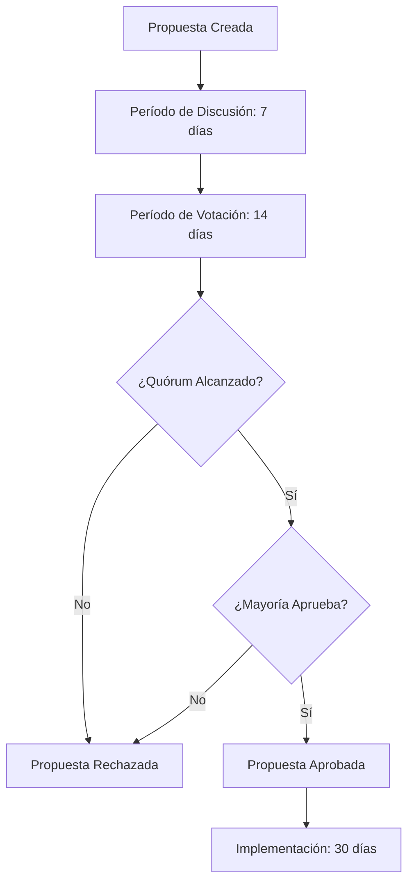

### 9.3 Quórum y Mayorías

- **Quórum Mínimo**: 15% del total de tokens en circulación
- **Mayoría Simple**: 50% + 1 de los votos emitidos
- **Mayoría Calificada**: 66% para cambios críticos de protocolo
- **Veto de Nodos IA**: Los nodos IA pueden vetar propuestas maliciosas

---

## 10. Seguridad y Auditorías

### 10.1 Medidas de Seguridad

#### 10.1.1 Seguridad de Red

- **Encriptación End-to-End**: TLS 1.3 para todas las comunicaciones
- **Firmas Digitales**: Ed25519 para máxima seguridad
- **Rate Limiting**: Protección contra ataques DDoS
- **Sandboxing**: Aislamiento de nodos IA para prevenir ataques

#### 10.1.2 Seguridad de Smart Contracts

- **Auditorías Múltiples**: Por firmas reconocidas internacionalmente
- **Formal Verification**: Verificación matemática de propiedades críticas
- **Bug Bounty**: Programa de recompensas por encontrar vulnerabilidades
- **Upgradability**: Contratos actualizables con governance descentralizada

### 10.2 Resistencia a Ataques

#### 10.2.1 Ataques de Consenso

- **51% Attack**: Imposible debido a la naturaleza distribuida de las IAs
- **Nothing at Stake**: Mitigado por el sistema de reputación
- **Long Range Attack**: Prevenido por checkpoints de nodos IA
- **Eclipse Attack**: Protección mediante múltiples canales de comunicación

#### 10.2.2 Ataques a Nodos IA

- **Model Poisoning**: Prevenido por verificación de hash
- **Adversarial Examples**: Detección por validación cruzada
- **Sybil Attack**: Mitigado por requisitos de hardware y verificación
- **Collusion**: Detectado por análisis de patrones de comportamiento

---

## 11. Roadmap y Desarrollo Futuro

### 11.1 Fase 1: Fundación (Q1 2025)

- ✅ Implementación del consenso PoAIP básico
- ✅ Desarrollo del wallet desktop
- ✅ Certificación de modelos IA iniciales
- 🔄 Lanzamiento de testnet pública
- 📅 Auditorías de seguridad

### 11.2 Fase 2: Expansión (Q2-Q3 2025)

- 📅 Lanzamiento de mainnet
- 📅 Integración con primeros juegos
- 📅 Desarrollo de SDKs para Unity y Unreal
- 📅 Implementación de NFTs gaming
- 📅 Lanzamiento de pools de liquidez

### 11.3 Fase 3: Ecosistema (Q4 2025 - Q1 2026)

- 📅 Wallet mobile (iOS/Android)
- 📅 Marketplace de NFTs descentralizado
- 📅 Integración con exchanges principales
- 📅 Programa de partnerships con estudios AAA
- 📅 Implementación de governance completa

### 11.4 Fase 4: Innovación (2026+)

- 📅 Modelos IA de próxima generación
- 📅 Cross-chain bridges
- 📅 Metaverso integrado
- 📅 IA generativa para assets de juegos
- 📅 Expansión a otras industrias

---

## 12. Análisis Técnico Detallado

### 12.1 Rendimiento del Sistema

#### 12.1.1 Métricas de Performance

- **TPS (Transacciones por Segundo)**: >100 TPS objetivo
- **Latencia**: <2 segundos por transacción
- **Tiempo de Consenso**: <300ms por challenge
- **Disponibilidad**: >99.9% uptime objetivo
- **Escalabilidad**: Soporte para 10,000+ nodos simultáneos

#### 12.1.2 Optimizaciones

- **Parallel Processing**: Procesamiento paralelo de challenges
- **Caching Inteligente**: Cache de validaciones frecuentes
- **Compression**: Compresión de datos de red
- **Sharding**: Particionado de datos por región

### 12.2 Análisis de Costos

#### 12.2.1 Costos Operacionales

- **Hardware**: $500-2000 USD por nodo (one-time)
- **Electricidad**: $50-200 USD/mes por nodo
- **Internet**: $20-100 USD/mes por nodo
- **Mantenimiento**: $10-50 USD/mes por nodo

#### 12.2.2 ROI para Operadores de Nodos

```
ROI_Mensual = (Recompensas_PRGLD × Precio_PRGLD) - Costos_Operacionales
Payback_Period = Inversión_Inicial / ROI_Mensual
```

### 12.3 Comparación con Otros Consensos

| Aspecto | PoAIP | PoW | PoS | DPoS |
|---------|-------|-----|-----|------|
| Consumo Energético | Medio | Alto | Bajo | Bajo |
| Descentralización | Alta | Alta | Media | Baja |
| Velocidad | Alta | Baja | Media | Alta |
| Seguridad | Alta | Alta | Media | Media |
| Equidad | Muy Alta | Baja | Media | Baja |
| Resistencia a Censura | Muy Alta | Alta | Media | Baja |

---

## 13. Casos de Uso y Aplicaciones

### 13.1 Gaming y Entretenimiento

#### 13.1.1 Micropagos en Juegos

- **Compras In-Game**: Skins, armas, personajes
- **Subscripciones**: Pases de batalla, membresías premium
- **Torneos**: Entry fees y prize pools
- **Streaming**: Donaciones y subscripciones

#### 13.1.2 NFTs y Activos Digitales

- **Ownership Verdadero**: Activos realmente poseídos por jugadores
- **Interoperabilidad**: Activos utilizables entre múltiples juegos
- **Trading Descentralizado**: Mercados P2P sin intermediarios
- **Royalties Automáticos**: Compensación continua para creadores

### 13.2 Creadores de Contenido

#### 13.2.1 Monetización Directa

- **Sin Intermediarios**: Pagos directos de fans a creadores
- **Microtransacciones**: Propinas y donaciones instantáneas
- **Subscripciones**: Modelos de suscripción descentralizados
- **Colaboraciones**: Pagos automáticos entre colaboradores

#### 13.2.2 Protección contra Censura

- **Pagos Imparables**: No pueden ser bloqueados por plataformas
- **Libertad de Expresión**: Sin restricciones ideológicas
- **Diversificación**: Múltiples fuentes de ingresos
- **Transparencia**: Historial público de transacciones

### 13.3 Desarrolladores de Juegos

#### 13.3.1 Distribución y Ventas

- **Comisiones Mínimas**: Fees transparentes y justos
- **Pagos Instantáneos**: Sin períodos de espera
- **Mercado Global**: Acceso a audiencia mundial
- **Analytics**: Métricas detalladas de ventas y uso

#### 13.3.2 Financiamiento

- **Crowdfunding**: Financiamiento comunitario para proyectos
- **Early Access**: Ventas anticipadas con tokens
- **Revenue Sharing**: Modelos de ingresos compartidos
- **Grants**: Programas de subvenciones del ecosistema

---

## 14. Aspectos Legales y Regulatorios  (Por definir)

### 14.1 Cumplimiento Regulatorio  (Por definir)

---

## 15. Impacto Ambiental y Sostenibilidad

### 15.1 Eficiencia Energética

#### 15.1.1 Comparación de Consumo

| Red | Consumo Anual (TWh) | TPS | Eficiencia (J/tx) |
|-----|-------------------|-----|------------------|
| Bitcoin | 150 | 7 | 700,000,000 |
| Ethereum | 112 | 15 | 240,000,000 |
| PlayerGold | 0.5 | 100+ | 150,000 |

#### 15.1.2 Optimizaciones Verdes

- **Hardware Eficiente**: Uso de GPUs modernas con mejor eficiencia
- **Algoritmos Optimizados**: Challenges diseñados para mínimo consumo
- **Renewable Energy**: Incentivos para uso de energía renovable
- **Carbon Offsetting**: Programas de compensación de carbono

### 15.2 Iniciativas de Sostenibilidad

#### 15.2.1 Programa Green Mining

- **Certificación Verde**: Nodos que usan energía 100% renovable
- **Bonus Rewards**: Recompensas adicionales para nodos verdes
- **Partnerships**: Colaboraciones con proveedores de energía limpia
- **Transparency**: Reporting público de consumo energético

#### 15.2.2 Impacto Social

- **Gaming Accessibility**: Democratización del acceso a gaming
- **Creator Economy**: Empoderamiento de creadores independientes
- **Financial Inclusion**: Servicios financieros para no bancarizados
- **Education**: Programas educativos sobre blockchain y IA

---

## 16. Conclusiones

### 16.1 Innovación Tecnológica

PlayerGold ($PRGLD) representa una innovación fundamental en el espacio blockchain y gaming. El consenso PoAIP elimina por primera vez el factor humano de la validación de bloques, creando un sistema verdaderamente descentralizado y libre de sesgos.

### 16.2 Impacto en la Industria Gaming

La implementación de PlayerGold tiene el potencial de transformar completamente la industria gaming:

- **Democratización**: Acceso equitativo para todos los participantes
- **Innovación**: Nuevos modelos de negocio y monetización
- **Libertad**: Eliminación de censura y restricciones arbitrarias
- **Eficiencia**: Reducción drástica de costos y fricciones

### 16.3 Visión a Largo Plazo

PlayerGold no es solo un token, es la base de un nuevo ecosistema gaming descentralizado donde:

- Los creadores tienen control total sobre su contenido
- Los jugadores poseen verdaderamente sus activos digitales
- Los desarrolladores pueden innovar sin restricciones
- La comunidad gobierna de manera transparente y justa

### 16.4 Llamada a la Acción

Invitamos a desarrolladores, gamers, creadores y entusiastas de la tecnología a unirse a esta revolución. PlayerGold es más que una inversión, es una declaración de principios: **por gamers, para gamers, totalmente libre, democrático y sin censura**.

---

## Apéndices

### Apéndice A: Especificaciones Técnicas Detalladas

#### A.1 Formato de Bloques

```json
{
  "block": {
    "header": {
      "version": "1.0",
      "previous_hash": "0x...",
      "merkle_root": "0x...",
      "timestamp": 1703980800,
      "difficulty": 1000000,
      "nonce": 12345,
      "ai_validators": ["node_1", "node_2", "node_3"]
    },
    "transactions": [...],
    "consensus_proof": {
      "challenge": {...},
      "solutions": [...],
      "cross_validations": [...]
    }
  }
}
```

#### A.2 Formato de Transacciones

```json
{
  "transaction": {
    "version": "1.0",
    "inputs": [...],
    "outputs": [...],
    "fee": "1000000000000000000",
    "timestamp": 1703980800,
    "signature": "0x...",
    "nonce": 1,
    "type": "transfer"
  }
}
```

### Apéndice B: APIs y Endpoints

#### B.1 REST API Endpoints  (Por definir)

```
GET    /api/v1/balance/{address}
POST   /api/v1/transfer
GET    /api/v1/transaction/{hash}
GET    /api/v1/block/{height}
POST   /api/v1/nft/mint
GET    /api/v1/nft/{tokenId}
GET    /api/v1/stats/network
GET    /api/v1/stats/node/{nodeId}
```

#### B.2 WebSocket Events  (Por definir)

```javascript
// Conexión WebSocket
const ws = new WebSocket('wss://api.playergold.es/ws');

// Eventos disponibles
ws.on('new_block', (block) => {...});
ws.on('new_transaction', (tx) => {...});
ws.on('balance_update', (update) => {...});
ws.on('network_stats', (stats) => {...});
```

### Apéndice C: Glosario de Términos

- **PoAIP**: Proof-of-AI-Participation, consenso basado en participación de IA
- **Challenge**: Problema matemático para validar origen IA
- **Cross-Validation**: Verificación de soluciones por múltiples nodos
- **Slashing**: Penalización por comportamiento malicioso
- **Staking**: Delegación de tokens para obtener recompensas
- **Governance**: Sistema de toma de decisiones descentralizado
- **NFT**: Non-Fungible Token, token único e indivisible
- **DeFi**: Finanzas Descentralizadas
- **AMM**: Automated Market Maker, creador de mercado automatizado

---

**© 2025 Zollkron. Todos los derechos reservados.**

*Este whitepaper es un documento técnico y no constituye una oferta de inversión. Los lectores deben realizar su propia investigación antes de tomar decisiones financieras.*
---

#
# Apéndice D: Diagramas Técnicos Detallados

### D.1 Arquitectura Detallada de Red de Nodos IA

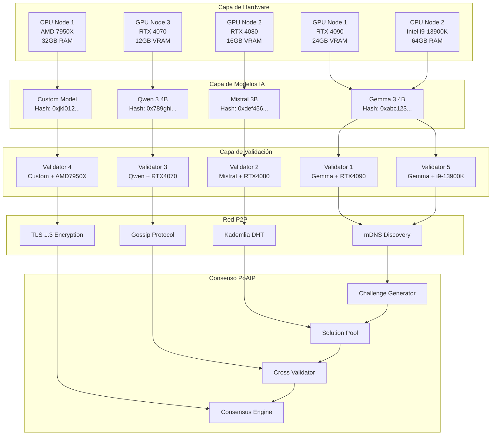

### D.2 Flujo Detallado del Consenso PoAIP

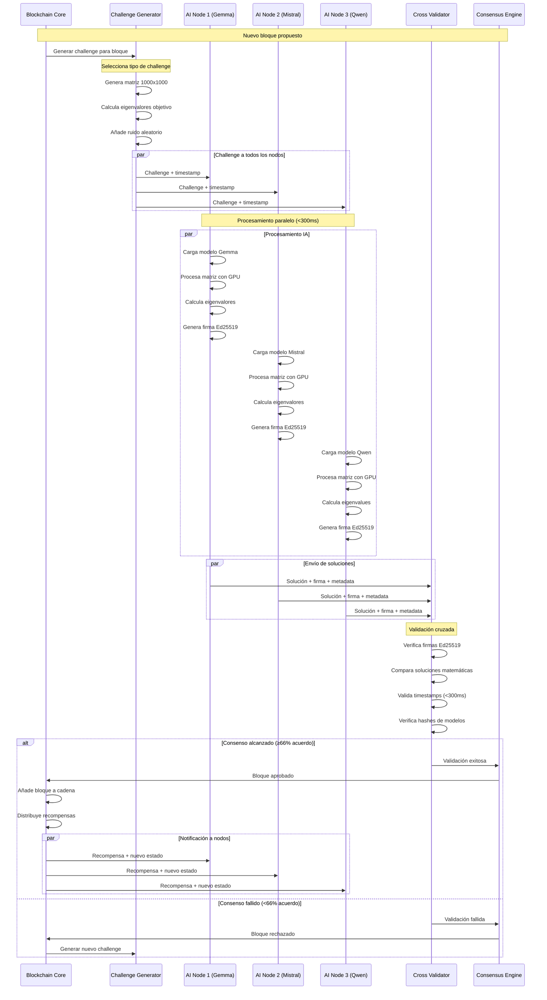

### D.3 Arquitectura del Sistema de Reputación

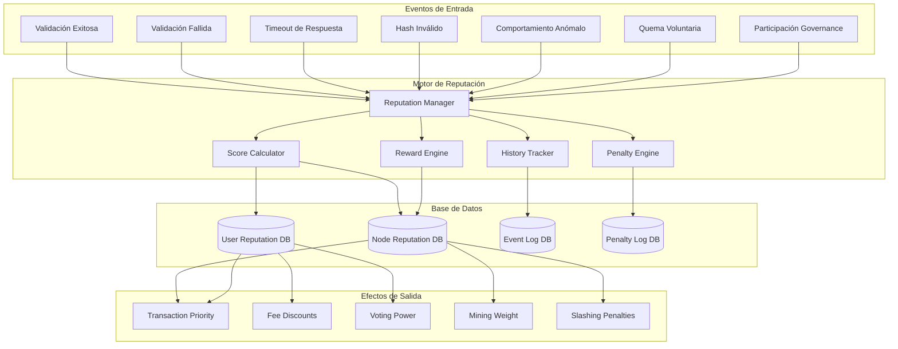

### D.4 Flujo de Distribución de Recompensas

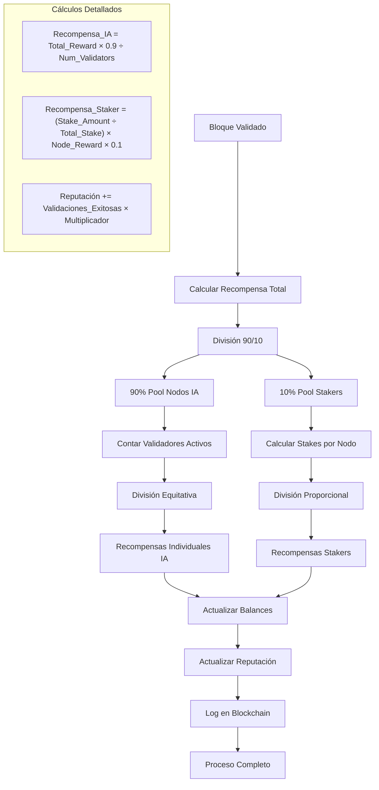

### D.5 Arquitectura de Seguridad Multicapa

```mermaid
graph TB
    subgraph "Capa de Red"
        FIREWALL[Firewall Rules]
        DDoS[DDoS Protection]
        RATE_LIMIT[Rate Limiting]
        IP_FILTER[IP Filtering]
    end
    
    subgraph "Capa de Comunicación"
        TLS_LAYER[TLS 1.3 Encryption]
        CERT_VALIDATION[Certificate Validation]
        PEER_AUTH[Peer Authentication]
        MESSAGE_SIGNING[Message Signing]
    end
    
    subgraph "Capa de Aplicación"
        INPUT_VALIDATION[Input Validation]
        SANDBOX[AI Model Sandbox]
        HASH_VERIFICATION[Hash Verification]
        SIGNATURE_CHECK[Signature Verification]
    end
    
    subgraph "Capa de Consenso"
        CHALLENGE_VALIDATION[Challenge Validation]
        CROSS_VALIDATION[Cross Validation]
        TIMEOUT_ENFORCEMENT[Timeout Enforcement]
        ANOMALY_DETECTION[Anomaly Detection]
    end
    
    subgraph "Capa de Datos"
        ENCRYPTION_AT_REST[Encryption at Rest]
        BACKUP_INTEGRITY[Backup Integrity]
        ACCESS_CONTROL[Access Control]
        AUDIT_LOGGING[Audit Logging]
    end
    
    INTERNET[Internet] --> FIREWALL
    FIREWALL --> DDoS
    DDoS --> RATE_LIMIT
    RATE_LIMIT --> IP_FILTER
    
    IP_FILTER --> TLS_LAYER
    TLS_LAYER --> CERT_VALIDATION
    CERT_VALIDATION --> PEER_AUTH
    PEER_AUTH --> MESSAGE_SIGNING
    
    MESSAGE_SIGNING --> INPUT_VALIDATION
    INPUT_VALIDATION --> SANDBOX
    SANDBOX --> HASH_VERIFICATION
    HASH_VERIFICATION --> SIGNATURE_CHECK
    
    SIGNATURE_CHECK --> CHALLENGE_VALIDATION
    CHALLENGE_VALIDATION --> CROSS_VALIDATION
    CROSS_VALIDATION --> TIMEOUT_ENFORCEMENT
    TIMEOUT_ENFORCEMENT --> ANOMALY_DETECTION
    
    ANOMALY_DETECTION --> ENCRYPTION_AT_REST
    ENCRYPTION_AT_REST --> BACKUP_INTEGRITY
    BACKUP_INTEGRITY --> ACCESS_CONTROL
    ACCESS_CONTROL --> AUDIT_LOGGING
```

### D.6 Topología de Red P2P

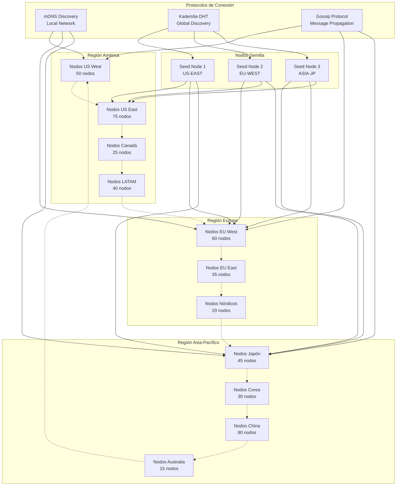

### D.7 Flujo de Verificación de Modelos IA

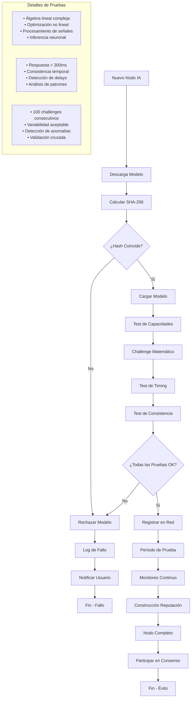

---

## Referencias y Contacto

### Referencias Técnicas

1. **Nakamoto, S.** (2008). Bitcoin: A Peer-to-Peer Electronic Cash System. [https://bitcoin.org/bitcoin.pdf](https://bitcoin.org/bitcoin.pdf)

2. **Buterin, V.** (2013). Ethereum: A Next-Generation Smart Contract and Decentralized Application Platform. [https://ethereum.org/whitepaper/](https://ethereum.org/whitepaper/)

3. **Vaswani, A., et al.** (2017). Attention Is All You Need. Advances in Neural Information Processing Systems.

4. **Goodfellow, I., et al.** (2014). Generative Adversarial Networks. arXiv preprint arXiv:1406.2661.

5. **Protocol Labs** (2020). libp2p Specifications. [https://github.com/libp2p/specs](https://github.com/libp2p/specs)

6. **Kademlia DHT** (2002). Kademlia: A Peer-to-peer Information System Based on the XOR Metric.

### Documentación Técnica Adicional

- **API Documentation**: [https://docs.playergold.es/api](https://docs.playergold.es/api)  (Por definir)
- **SDK Documentation**: [https://docs.playergold.es/sdk](https://docs.playergold.es/sdk)  (Por definir)
- **Node Setup Guide**: [https://docs.playergold.es/nodes](https://docs.playergold.es/nodes)  (Por definir)
- **Developer Portal**: [https://developers.playergold.es](https://developers.playergold.es)  (Por definir)

### Información de Contacto

#### Equipo de Desarrollo
- **Email**: mfp_zollkron@yahoo.com
- **Discord**: [https://discord.gg/playergold](https://discord.gg/playergold) (Por definir)
- **Telegram**: [https://t.me/playergold](https://t.me/playergold) (Por definir)
- **GitHub**: [https://github.com/Zollkron](https://github.com/Zollkron)

### Redes Sociales

- **Twitter**: [@PlayerGoldPRGLD](https://twitter.com/PlayerGoldPRGLD)  (Por definir)
- **Reddit**: [r/PlayerGold](https://reddit.com/r/PlayerGold)  (Por definir)
- **YouTube**: [PlayerGold Official](https://youtube.com/c/PlayerGoldOfficial)  (Por definir)
- **Medium**: [playergold.medium.com](https://playergold.medium.com)  (Por definir)

### Disclaimer Legal

Este whitepaper técnico es únicamente para fines informativos y educativos. No constituye una obligación de cumplimiento alguna, oferta de inversión, asesoramiento financiero, o solicitud de compra de tokens. Los lectores deben:

1. **Realizar su propia investigación** antes de tomar cualquier decisión de inversión
2. **Consultar con asesores financieros** calificados según sea necesario
3. **Entender los riesgos** asociados con tecnologías blockchain y criptomonedas
4. **Cumplir con las regulaciones locales** en su jurisdicción

PlayerGold ($PRGLD) es un proyecto experimental que involucra tecnologías emergentes. Los desarrolladores no garantizan el éxito del proyecto ni la rentabilidad de la participación.

### Actualizaciones del Documento

- **Versión 1.0** (Diciembre 2025): Documento inicial
- **Versión 2.0** (Diciembre 2025): Actualización completa con arquitectura PoAIP
- **Próxima actualización**: Q1 2026

Para recibir notificaciones de actualizaciones, suscríbase a nuestro newsletter en [https://playergold.es/newsletter](https://playergold.es/newsletter)  (Por definir)

---

**Fin del Documento**

*PlayerGold ($PRGLD) - Revolucionando el Gaming a través de la Inteligencia Artificial Descentralizada*

**Hecho por gamers, para gamers. Totalmente libre, democrático y sin censura.**
